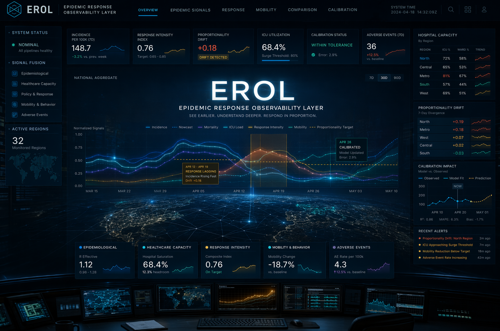

# EROL - Epidemic Response Observability Layer

Public-safe observability framework for tracking proportionality, drift, and calibration in large-scale epidemic response systems.

## Observatory Surface

Initial public visual direction for EROL as an epidemic response observability layer.

## One-Line Summary

EROL studies whether large-scale response systems remain proportional to real-world epidemic signals over time.

## What This Public Repository Shows

This repository is the public documentation layer of EROL.

It is designed to show:

- the research direction
- the public-safe architecture
- the observability logic
- the signal model
- the practical scope of the project

It does **not** expose private implementation details, sensitive data logic, or policy-sensitive internal experimentation.

## What It Is

EROL (Epidemic Response Observability Layer) is an external observability direction inside the broader ASA family.

It is designed to monitor how response systems evolve over time relative to real-world signals such as:

- hospitalization pressure
- ICU saturation
- mortality trends
- adverse-event reporting
- mobility and behavioral indicators
- testing positivity and bias indicators
- policy interventions and response timing

The key idea is simple:

large-scale crisis systems should be observable not only in terms of action, but in terms of whether those actions remain proportional over time.

## What It Is Not

EROL is **not**:

- a clinical system
- a treatment recommendation engine
- a public-health authority substitute
- a system for controlling people
- a political enforcement layer

EROL is an external observability and calibration layer.

## Why It Matters

In large-scale epidemic response, failure does not always come from lack of action.

It can also come from:

- drift between interventions and actual risk
- delayed recalibration
- overreaction or underreaction across time
- inability to compare multiple signal families coherently
- decision systems that lose proportionality under pressure

EROL is intended to make that phase visible.

## Core Direction

EROL should be understood as a proportionality observability layer for epidemic response systems.

Its public role is to make visible questions such as:

- does response intensity stay aligned with real-world pressure?
- do response trajectories drift away from underlying risk?
- do multiple signal families confirm or contradict the same intervention logic?
- does the system recalibrate when the signal landscape changes?

## Public Reading Rules

EROL should be read through four public-safe rules:

1. observability, not authority
2. proportionality, not ideology
3. trajectory analysis, not single-snapshot interpretation
4. calibration support, not enforcement

## Reading Guide

This repository currently includes a public-safe set of architecture documents:

- [EROL Public Scope](docs/EROL_PUBLIC_SCOPE.md)
  - what this public repository is meant to show and what stays private

- [EROL Public Architecture](docs/EROL_PUBLIC_ARCHITECTURE.md)
  - high-level structure of EROL as an external response observability layer

- [EROL Public Signal Model](docs/EROL_PUBLIC_SIGNAL_MODEL.md)
  - public-safe signal families used for response drift and proportionality analysis

- [EROL What It Is / Is Not](docs/EROL_WHAT_IT_IS_AND_IS_NOT.md)
  - public-safe distinction between observability and intervention

- [EROL Use Cases](docs/EROL_USE_CASES.md)
  - public-safe examples of where epidemic response observability becomes useful

## Public Scope

This public repository is the safe documentation layer for EROL.

It is intended for:

- architecture framing
- public-safe research communication
- partner-safe observability explanation
- neutral technical positioning

It is not the private implementation repository.

## Current Status

Status: public-safe architecture and concept layer.

EROL should be read as:

- a crisis observability direction
- a proportionality-focused monitoring framework
- a public-safe research surface inside the ASA family

## Guiding Principle

The goal is not to decide outcomes.

The goal is to detect when the response system itself begins to drift away from the risk landscape it is supposed to track.
